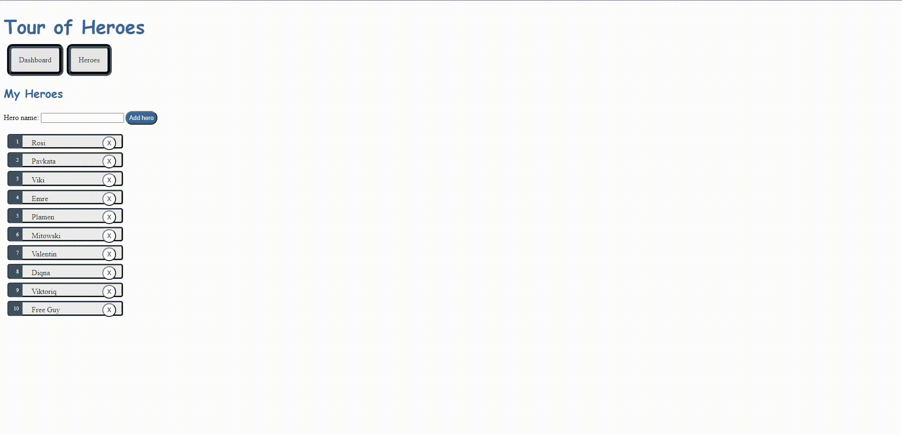

# Angular - Tour Of Heroes 
Tutorial for the framework on the official website.

# Currently app is looking like this:

# App was roughly finished in 4 days:
    Day 1. 
        - Setup the app
        - Created main components
        - Making the heroes component display a list of mock heroes
    Day 2.
        - Created hero details component which shows the details of a hero when clicked(displayed under the content of the heroes 
          list in the heroes component)
        - Adding hero and message services. Hero service is intended to keep all methods that make changes to the heroes list
          while message service is generating messages when an action occurs.
    Day 3.
        - Add navigation to the application(Dashboard, Heroes). 
          Dashboard brings out top players, Heroes brings out a list of all heroes. 
        - Added more detailed CSS(still pretty basic).
        - Routed the navigation.
        - Pulled out the heroes details and made a route for them in the navigation(now it's showed separately and individually)
    Day 4.
        - Simulated a data server with InMemoryWebApiModule so I can simulate basic CRUD operations.
        - Added more CSS.

    To run the app clone the repo and run npm install and ng serve -o.
